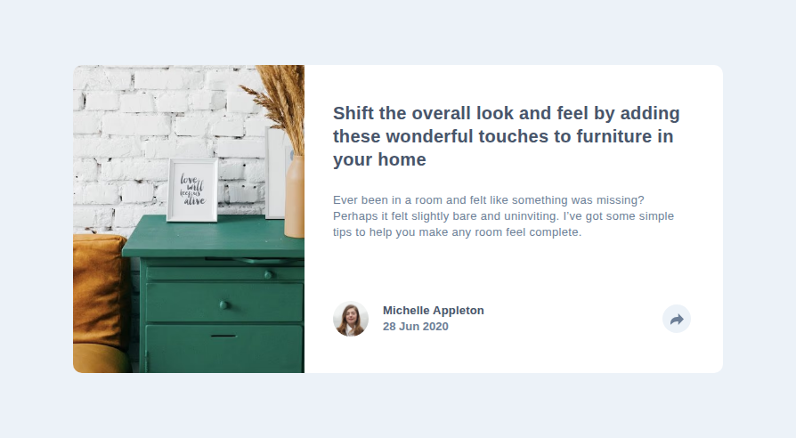

# Frontend Mentor - Article preview component solution

This is a solution to the [Article preview component on Frontend Mentor](https://www.frontendmentor.io/challenges/article-preview-component-dYBN_pYFT).
Frontend Mentor challenges help improve frontend skills by building realistic UI components.

## Table of contents

- [Overview](#overview)
  - [Preview](#screenshot)
  - [Links](#links)
- [Features](#features)
- [My process](#my-process)
  - [Built with](#built-with)
  - [What I learned](#what-i-learned)
- [Setup](#setup)
  - [Installation](#installation)
  - [Image Optimization](#image-optimization)
  - [Development](#development)
  - [Build](#build)
  - [Linting](#linting)
- [Deployment](#deployment)
- [Performance](#performance)
- [Continued Development](#continued-development)
- [Useful Resources](#useful-resources)
- [AI Collaboration](#ai-collaboration)
- [Author](#author)
- [Notes](#notes)

## Overview

### The challenge

Users should be able to:

- View the optimal layout for the component depending on their device's screen size
- See the social media share links when they click the share icon
- See hover states for all interactive elements on the page

### Preview

<details>
  <summary>Click to expand website preview</summary>
  <br>
  <p align="center">
    
  </p>
</details>

### Links

- Solution URL: [GitHub Repo](https://github.com/vlrnsnk/article-preview-component)
- Live Site URL: [Live Site](https://vlrnsnk.github.io/article-preview-component)

## Features

- Responsive mobile-first layout (mobile → tablet/desktop at 48rem / 768px)
- Two distinct share UIs: a full-width bottom bar on mobile that cross-fades with the footer, and a popup tooltip above the share button on tablet/desktop
- Animated toast open/close using `transition-behavior: allow-discrete` + `@starting-style` (slide-up + fade), with `prefers-reduced-motion` respected
- Accessible interactive states (`hover`, `focus-visible`) kept separate per modern best practice
- Keyboard support: `Escape` closes the toast, focus returns to the trigger
- Outside-click-to-close on the share popup
- Semantic HTML with `aria-expanded` / `aria-controls` kept in sync via JS
- Modular BEM SCSS architecture (one file per block) using `@use`
- Centralized motion tokens (`$transition-duration`, `$transition-easing`) driving a shared `transition()` mixin
- Optimized `<picture>` pipeline (AVIF → WebP → fallback) via Sharp
- Stylelint with property-order enforcement + Husky pre-commit hooks
- Automated deployment to GitHub Pages via GitHub Actions

## My process

### Built with

- Semantic HTML5 markup
- SCSS (modular architecture: abstracts, base, components, layout)
- CSS custom properties (design tokens via SCSS variables)
- Flexbox / Grid
- Mobile-first workflow
- Vite
- Sharp image processing
- Stylelint (code quality + property ordering)
- HTML validation
- Husky (pre-commit hooks)

### What I learned

- **Animating `display` is possible.** A plain `hidden` attribute toggle can't transition, but pairing `transition-behavior: allow-discrete` on `display` with `@starting-style` lets the browser delay the `display` flip until opacity/transform finish — enabling true enter/exit animations without JS class juggling.
- **`overflow: hidden` is a clipping trap for popovers.** Moving `overflow: hidden` from the card to just the image element freed the toast to escape the card bounds on desktop, while still clipping the image's rounded corners.
- **`inset` and its logical variants.** `inset`, `inset-block`, `inset-inline` map to top/right/bottom/left and stay RTL-safe. A lingering `inset-inline: 0` from a mobile base rule silently pinned a desktop popup to the card edge — `inset: auto` released it.
- **Flex vs grid centering differs.** `place-items: center` centers a grid _item within its track_ (track shrinks to content → no centering when content overflows), whereas `place-content: center` centers the _tracks within the container_ — the grid equivalent of flex's behavior.
- **Modern focus vs hover separation.** `:focus-visible` should carry only an outline (a11y signal); `:hover` carries color/background; `:active` carries the press transform. Don't duplicate states.
- **DRY motion via tokens + mixin.** Centralizing duration/easing in SCSS variables and a `transition()` mixin (with a `display` → `allow-discrete` branch) keeps every animation consistent from one dial.
- **BEM: one file per block, even single-use.** Extracting `.social` into its own partial matched the project's convention and stayed ready for reuse.

## Setup

### Installation

```bash
npm install
```

### Image optimization

Generate modern image formats:

```bash
npm run images
```

This creates .webp and .avif versions of images inside:

```bash
src/assets/images/
```

Example:

```bash
image-hero.png
image-hero.webp
image-hero.avif
```

Use <picture> with AVIF → WebP → original fallback:

```html
<picture>
  <source srcset="image.avif" type="image/avif" />
  <source srcset="image.webp" type="image/webp" />
  
</picture>
```

### Development

```bash
npm run dev
```

### Build

```bash
npm run build
npm run preview
```

### Linting

```bash
npm run lint:scss
npm run lint:html
```

This project uses Stylelint + EditorConfig + Husky pre-commit hooks
to ensure consistent code formatting before commits.

### Fix linting issues:

```bash
npm run lint:scss:fix
npm run lint:html:fix
```

## Deployment

Project is built with Vite and deployed to GitHub Pages using GitHub Actions.

## Performance

Lighthouse score:

- Performance: 100
- Accessibility: 95
- Best Practices: 100
- SEO: 100

_Accessibility score was reduced due to insufficient color contrast in the provided design palette._

## Continued Development

- **Tokenize breakpoints.** The `48rem` (768px) breakpoint is repeated across component files; promoting it to a `$breakpoint-tablet` token would keep layout switches in sync from one place.
- **CSS custom properties at runtime.** Motion is currently compile-time SCSS variables. For context-aware tuning (e.g. slower easings on larger screens) CSS custom properties would allow runtime/media-query overrides.
- **Popover anchoring.** The desktop toast is positioned with tuned `inset` values; adopting the native CSS `anchor-positioning` API (or a small JS measure) would lock it to the button at any width without magic numbers.
- **Reduced-motion coverage.** The global `prefers-reduced-motion` guard already neutralizes transitions; a follow-up could also disable `@starting-style` enter animations explicitly for full parity.

## Useful Resources

- [MDN: `transition-behavior` and `allow-discrete`](https://developer.mozilla.org/en-US/docs/Web/CSS/transition-behavior) - The key to animating `display`/`hidden`; the exact technique used for the toast enter/exit.
- [MDN: `@starting-style`](https://developer.mozilla.org/en-US/docs/Web/CSS/@starting-style) - Defines the first-frame state for newly-rendered elements so they can animate in.
- [MDN: CSS `inset` property](https://developer.mozilla.org/en-US/docs/Web/CSS/inset) - Logical shorthands and how they resolve, which explained the desktop popup pinning bug.
- [MDN: `:focus-visible`](https://developer.mozilla.org/en-US/docs/Web/CSS/:focus-visible) - Why focus and hover should be styled separately.
- [BEM methodology](https://getbem.com/) - One-block-per-file structure used throughout the SCSS components.

## AI Collaboration

This project was built in close collaboration with **Claude** (Anthropic's Claude Code CLI), used as a pair-programming partner throughout.

- **How it was used:** diagnosing Stylelint/SCSS compile errors, explaining CSS behavior (flex vs grid centering, `inset`, `overflow: hidden` clipping), proposing BEM restructuring, and guiding the JS share-toggle implementation. The human made all final design/code decisions and edits.
- **What worked well:** rapid root-cause analysis of subtle bugs (e.g. `toast` vs `shareToast` variable mismatch, `inset-inline: 0` persistence, `display` not transitioning) and clear explanations of modern CSS features.
- **What to improve:** early suggestions sometimes assumed conventions that didn't match the project (e.g. waiting for "second usage" before extracting a BEM block); correcting those mid-session produced better-aligned guidance. Treat AI output as a knowledgeable reviewer, not an authority — verify against the actual codebase.

## Author

- Website: https://vlrnsnk.com
- Frontend Mentor: https://www.frontendmentor.io/profile/vlrnsnk
- GitHub: https://github.com/vlrnsnk

## Notes

- **Breakpoints:** mobile-first; layout switches to side-by-side + popup toast at `48rem` (768px). Card caps at `45.625rem` (730px) from that point and centers, matching the FEM design intent (the 1440px figure is the showcase canvas, not a breakpoint).
- **Toast architecture:** on mobile the toast is a card-bottom overlay that cross-fades with the footer; on tablet/desktop it is a `position: absolute` popup above the share button, with a rotated-square `::after` arrow. `overflow: hidden` lives on the image only, so the popup can escape the card.
- **Motion:** centralized in `$transition-duration` / `$transition-easing` tokens via a `transition()` mixin (with a `display → allow-discrete` branch); `prefers-reduced-motion` is respected globally.
- **Accessibility:** `aria-expanded` / `aria-controls` synced in JS; `Escape` and outside-click close the toast; `:focus-visible` kept as outline-only.
- **Tooling:** modular BEM SCSS (`@use`), Stylelint property-order enforcement, Husky pre-commit hooks, Sharp image pipeline, Vite build, GitHub Pages via Actions.
